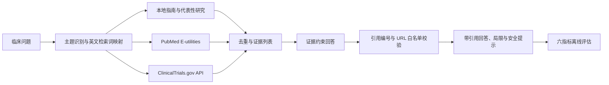

# 一页系统框架

## 赛道与目标

赛道一：临床证据助手。目标用户为临床医生、医学生和科研人员，主题覆盖心脑血管病、血脂、高血压与糖尿病。

## 数据流与降级

1. 问题按高血压、血脂、糖尿病和心脑血管主题映射为英文检索式。
2. 本地指南保证断网可演示，PubMed 与 ClinicalTrials.gov 在联网时补充新证据。
3. 所有证据先结构化为标题、摘要、来源类型、真实 URL 和唯一编号，再交给回答模块。
4. 没有 API Key 时使用抽取式回答；有 Key 时仅允许模型使用给定证据，并校验引用编号。
5. 外部 API、网络或大模型失败时保留本地证据回答并显示降级原因。

## 分工建议

| 工作流 | 负责人角色 | 交付物 |
| --- | --- | --- |
| 数据与检索 | 数据工程 | 500+ PubMed 语料、检索词与来源字段 |
| 回答与引用 | 后端/RAG | 证据约束提示词、引用校验、拒答策略 |
| 产品与界面 | 前端/产品 | 临床工作台、来源展示、离线开关 |
| 评估与安全 | 测试/临床审核 | 10 道问题、六指标报告、伦理边界 |

实际成员姓名可在展示前填写到本表。
