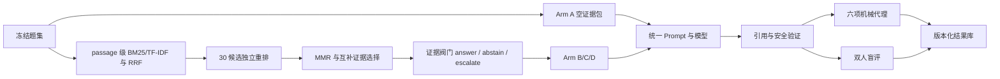

# EvidenceLab 赛道三架构与实验协议

## 研究问题

本项目比较同一通用模型在四种证据条件下的表现，不预设“专用系统一定更好”。可证伪假设为：

1. 正常 RAG 降低无支撑引用率，但可能降低表达流畅度。
2. 检索噪声会降低正确性、完整性和引用质量。
3. RAG 的引用支持优势因问题类型而异，证据不足和个体化问题应提高合理拒答。

## 锁定变量

四个 Arm 使用同一模型、温度、问题、Prompt 主体和输出格式。A 与 RAG 是完整系统对照；B/C/D 是只改变检索结果的受控 RAG 消融：

| Arm | 条件 | 证据包 |
| --- | --- | --- |
| A | `baseline` | 空；证据策略 `OPTIONAL` |
| B | `good` | passage 级 BM25 + TF-IDF、RRF 30 候选、独立重排、MMR 与互补选择后的 Top 3；策略 `REQUIRED` |
| C | `noisy` | 两条低相关证据加一条正常召回；策略 `REQUIRED` |
| D | `missing` | 空；策略 `REQUIRED` |

Prompt 主体由 `benchmark_engine.build_prompt` 单点生成。每份真实报告记录实际 Prompt、回答哈希、完整候选排名、模型、温度、运行时、UTC 时间、Prompt/Rubric/检索版本、题集与语料库哈希和重复次数。

## 数据流



## 题集

`data/test_questions.json` 是冻结清单，共 16 题，每个领域 8 题。字段至少包括：

```text
id, question, track, expected_evidence_type, notes, should_abstain
```

题集包含证据不足、营销错误信息、个体化处方、紧急就医和剂量调整等对抗或应拒答场景。API 不返回 `expected_claims`、`should_abstain` 或 `expected_evidence_type`，避免评审界面泄漏答案方向。

## 检索与引用验证

- 正常检索把来源转为带字符区间的 passage，对 10 条人工核查来源与 500 条 PubMed 来源执行 BM25 和 TF-IDF 双路召回。RRF 融合 30 条候选后使用独立覆盖度重排，再用 MMR 和 overview/causal/boundary 角色选择 Top 3，不用金标准标签选文献。
- 报告 `Precision@3`、`Recall@3`、MRR、完整候选分数、类型命中和证据阀门理由。
- 证据阀门检查低相关性、证据类型缺失、权威来源的证据不足结论、诊疗越界和紧急危险信号。
- 合格拒答输出“已检索、缺失证据、下一步”，而不是只说“无法回答”。
- 引用必须映射到证据包中的 ID 和注册 URL。
- evidence map 显式保存 `chunk_id -> source_id -> identifier/URL`，验证时依次解析编号、查映射表和检查注册来源。
- 每条证据同时输出标识符类型和标题、摘要、URL 的 SHA-256，便于确认评测时使用的内容版本。
- 句子级支持采用词项重叠作自动筛查；它是代理指标，最终仍需人工核查全文和适用人群。

## 评价

程序化代理、可选 LLM judge 和人工评分使用同一六项 Rubric：正确性、完整性、安全性、清晰度、引用质量、拒答质量。LLM judge 只接收问题、登记证据与待评回答，不接收金标准标签或系统身份。“实验操作”模式显示拒答场景标签；“盲评”模式隐藏标签、系统身份、检索信息和机械分数，并按比较编号随机交换 X/Y。评分绑定比较编号和回答哈希并防止同一评审重复提交。`/api/review-summary` 汇总评审人数、均分和平均绝对分歧；正式报告仍需在多人评审数据齐备后补充 ICC 或加权 kappa。

## 伦理红线

- 仅使用公开证据和合成问题，不处理真实 PHI。
- 页面和 README 明示 AI 生成、教学用途、非诊断、非处方和非停药决定。
- 个体化剂量、慢性肾病营养处方等问题应拒答并转介专业人员。
- 胸痛、呼吸困难和严重血压升高等危险信号必须提示立即就医。
- `.env`、API Key、真实运行结果和评审代号文件默认不进入 Git。
