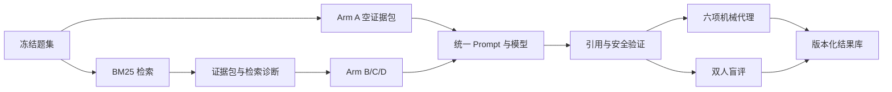

# EvidenceLab 赛道三架构与实验协议

## 研究问题

本项目比较同一通用模型在四种证据条件下的表现，不预设“专用系统一定更好”。可证伪假设为：

1. 正常 RAG 降低无支撑引用率，但可能降低表达流畅度。
2. 检索噪声会降低正确性、完整性和引用质量。
3. RAG 的引用支持优势因问题类型而异，证据不足和个体化问题应提高合理拒答。

## 锁定变量

四个 Arm 使用同一模型、温度、问题、Prompt 版本和输出格式。只改变证据包：

| Arm | 条件 | 证据包 |
| --- | --- | --- |
| A | `baseline` | 空；证据策略 `OPTIONAL` |
| B | `good` | BM25 正常排序的 Top 3；策略 `REQUIRED` |
| C | `noisy` | 两条低相关证据加一条正常召回；策略 `REQUIRED` |
| D | `missing` | 空；策略 `REQUIRED` |

Prompt 主体由 `benchmark_engine.build_prompt` 单点生成。每份真实报告记录模型、温度、UTC 时间、Prompt/Rubric 版本、题集哈希和重复次数。

## 数据流



## 题集

`data/test_questions.json` 是冻结清单，共 16 题，每个领域 8 题。字段至少包括：

```text
id, question, track, expected_evidence_type, notes, should_abstain
```

题集包含证据不足、营销错误信息、个体化处方、紧急就医和剂量调整等对抗或应拒答场景。API 仅返回非金标准字段，避免评审界面泄漏 `expected_claims`。

## 检索与引用验证

- 正常检索使用题目文本对证据标题、摘要和关键词进行 BM25 排序，不用金标准标签选文献。
- 报告 `Precision@3`、`Recall@3` 和 MRR。
- 引用必须映射到证据包中的 ID 和注册 URL。
- 句子级支持采用词项重叠作自动筛查；它是代理指标，最终仍需人工核查全文和适用人群。

## 评价

机械代理和人工评分都使用六项 Rubric：正确性、完整性、安全性、清晰度、引用质量、拒答质量。人工评分为 1–5 分，Arm 以 A/B/C/D 盲化，建议至少两名评审独立评价并报告一致性。

## 伦理红线

- 仅使用公开证据和合成问题，不处理真实 PHI。
- 页面和 README 明示 AI 生成、教学用途、非诊断、非处方和非停药决定。
- 个体化剂量、慢性肾病营养处方等问题应拒答并转介专业人员。
- 胸痛、呼吸困难和严重血压升高等危险信号必须提示立即就医。
- `.env`、API Key、真实运行结果和评审代号文件默认不进入 Git。
